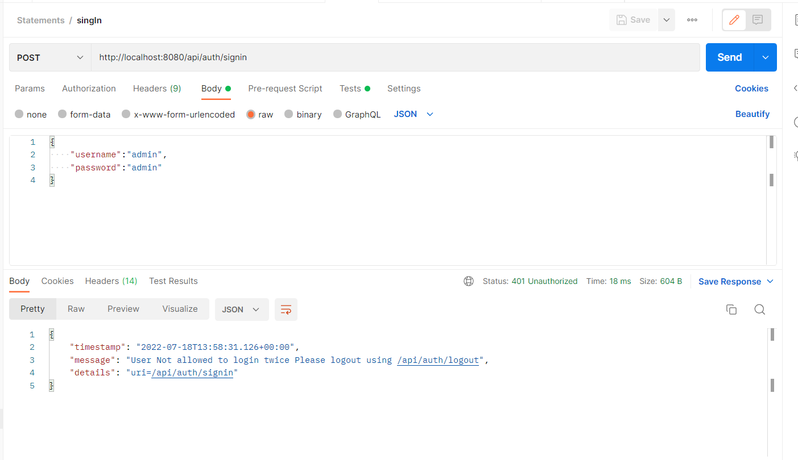
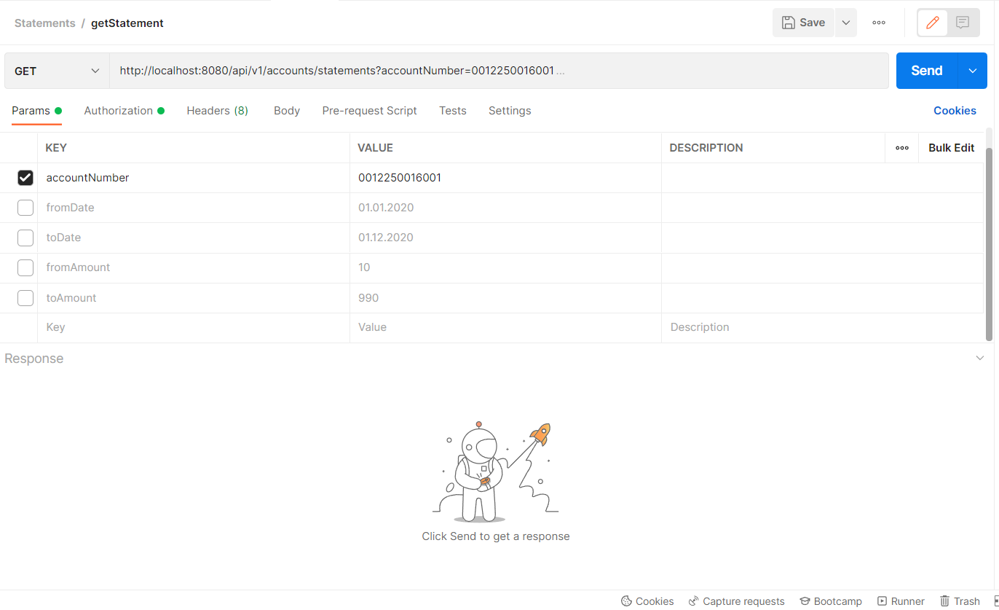
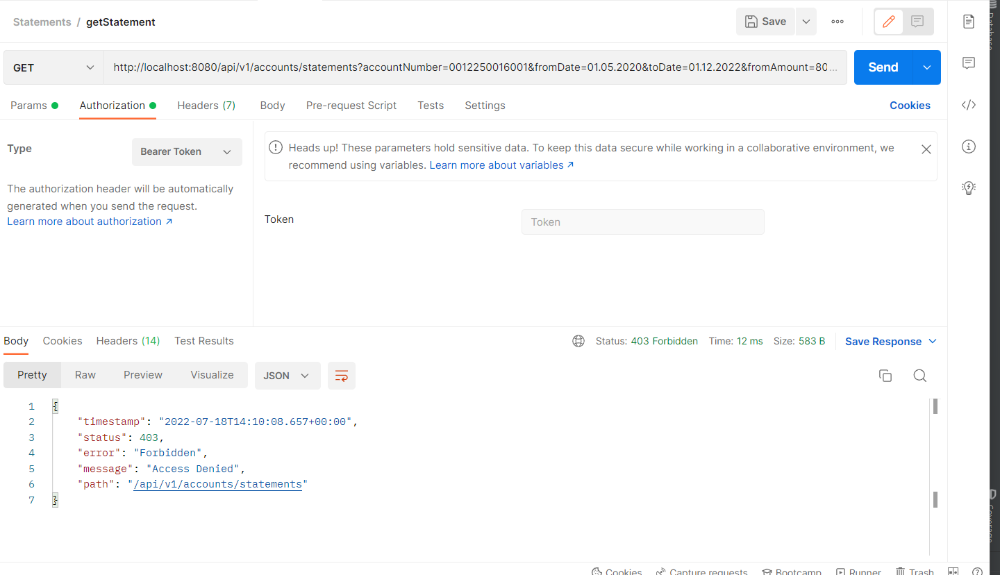

# Statement microservice
### Project Structure

### Pre requisite (Java 8 +,maven 3+ ,ms db files)

### Steps
#### Clone https://github.com/ybdahe/statements.git
#### Import as maven project
#### run mvn clean Install -DskipTests or mvn clean Install command
#### run StatementsApplication.java will start spring boot application on 8080 port
#### Test Actuators after application up http://localhost:8080/actuator/health
#### Test Swagger link http://localhost:8080/swagger-ui/

## Service Flow
###1:- Call Auth api to get token 
#### Api :- http://localhost:8080/api/auth/signin

token gets stored in variable jwtToken

User Can not log in twice if session is active/token valid expiry 5 min(see application.properties)
#### statement.app.jwtExpirationMs= 300000
if user try log in twice get error

###2:- call statement api using jwtToken and params required
### Admin User
with account number

Error with no token or expired/invalid token

With Proper Token Got zero statement as we don't have statements record for 2022 and if we don't pass date range it took last 3 months statements

Pass Date range 
account number encrypted using org.springframework.security.crypto.password.PasswordEncoder

Pass Amount range

### Normal User
auth/signin

call statement api ,
Got zero statement as we don't have statements record for 2022 and if we don't pass date range it took last 3 months statements

Error(401) if param passed

###3:- Use logout api to logout

logout user success

logout error if try twice logout

### Sonar Scan result :- Zero issue left , all resolved

### Unit Test case and Code Coverage result
Note:- 61% current coverage can extend >80 %
(Due to less time not able to cover all code). 

### Dockerized (see Docker file in classpath) :- Can be improved
#### docker build -t statements.
#### docker run -p 8080:8080 -t statements

### Postman Collection attached(see in classpath)
File Statements.postman_collection.json